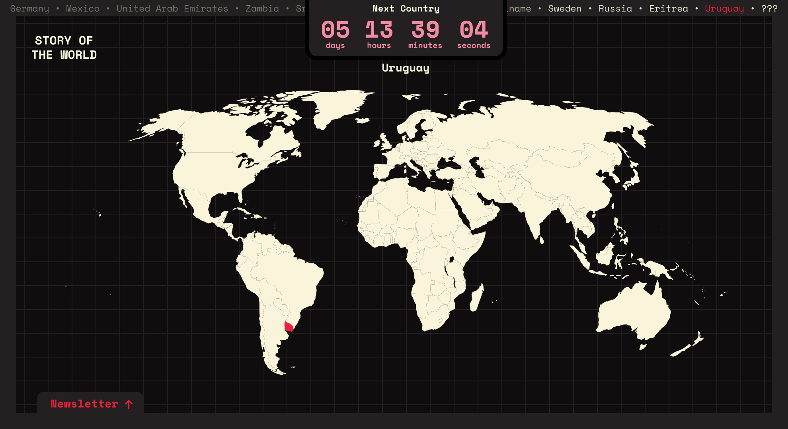

# Story of The World

!!THIS PROJECT CURRENTLY IS IN DEVELOPMENT AND WILL BE RELEASED SOON!!

- Framework: [Astro](https://astro.build/) and [Vue.js](https://vuejs.org)
- Styling: [TailwindCSS](https://tailwindcss.com)
- Animation and Interactivity: [GSAP](https://gsap.com) and [D3.js](https://d3js.org)
- Deployment: [Netlify](https://netlify.com)

### About

Hi there, you found my passion project! 😄 I love programming, learning about the world and its different countries, and writing. This project combines these three different areas.

After building the web app, I will release an essay about a country every week at the same time. I will dive into what makes the country special in an entertaining and informative way. That could be about the history of that country, its stereotypes, its culture, its people, etc... whatever makes that country special.

On top, there will be the possibility of subscribing to the newsletter to not miss the release of new countries. The text will be a 5-10 minute read. So if learning about the world gets you excited don't hesitate to subscribe 🙂.

Cheers!